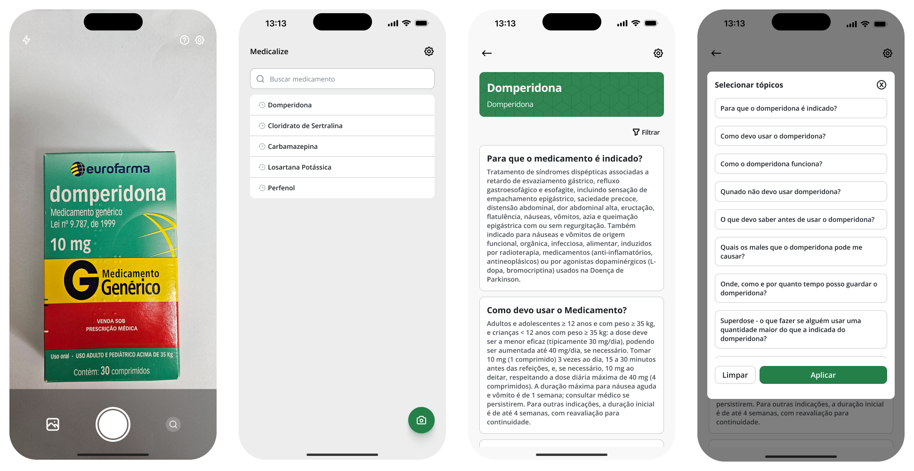

<h1 align="center">MEDICALIZE</h1>

Este projeto foi desenvolvido com o objetivo de auxiliar profissionais iniciantes que atuam em farmácias na identificação e no aprendizado sobre medicamentos, seja para aprimorar o atendimento ao cliente ou para fins de capacitação prévia. A solução utiliza uma combinação de Python, OpenCV e Tesseract para realizar a [extração e o reconhecimento de textos](https://github.com/ryanBrazs/text-extraction-api) em embalagens de medicamentos, facilitando o acesso rápido às informações essenciais.

> [!NOTE]
> É importante ressaltar que este projeto não substitui a atuação de um profissional farmacêutico. Além disso, para que sua implementação em um ambiente real seja viável, seria necessária a validação e o acompanhamento de especialistas da área.

## :hammer_and_wrench: Funcionalidades



**O que o Mdicalize oferece:**

- Câmera ou Upload de Imagens
- Busca por texto
- Visualização das informações dos medicamentos
- Filtragem das informações

## :computer: Configuração

### Pré requisitos
- Node
- Visual Studio Code
- Expo Go (Aplicativo disponível na Play Store ou App Store)
- Criar uma conta no [expo.dev](https://expo.dev/)

### Dependências
Para que possa ter uma experiência completa do funcionamento da aplicação, é necessário que as seguintes dependências estejam instaladas e em execução simultaneamente com esta aplicação:
- [TextExtractionApi](https://github.com/ryanBrazs/text-extraction-api)

### Apllicação

1. Clone este repositório em sua máquina:
```
git clone https://github.com/ryanBrazs/medicalize_app.git
```

2. Abra este repositório em seu Visual Studio Code

3. Instale as dependências

   ```
   npm install
   ```

4. Localize todas as requisições realizadas e substitua o IP fixo pelo endereço IP da sua própria máquina.

5. Certifique-se de que tanto esta aplicação e o seu dispositivo móvel estejam na mesma rede

6. Com a conta no [expo.dev](https://expo.dev/) ja criada, execute o seguinte comando e siga as etapas que serão apresentadas:
   ```
   eas login
   ```
   
7. Após concluir a etapa anterior, execute o seguinte comando:
  ```
  eas build -p android --profile development
  ```

8. Acesse o [expo.dev](https://expo.dev/), localize seu projeto e realize o download do APK gerado.

9. Execute o seguinte comando no terminal:
   ```
    npx expo start
   ```
10. Abra o aplicativo Medicalize em seu dispositivo móvel e insira, no campo indicado, a URL exibida no terminal onde o projeto está em execução.
    ```
    http://[seu-ip]:[porta]
    ```

## :gear: Tecnologias


&nbsp;
